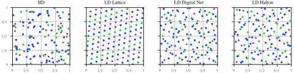
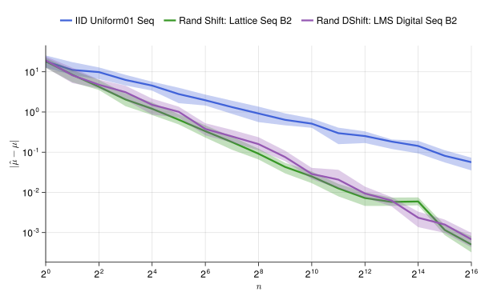
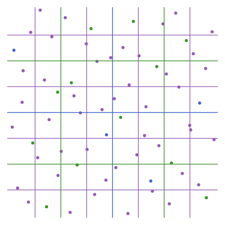

* Will be replaced with the ToC, excluding the "Contents" header
{:toc}

# Softwares


## FastGPs

```
pip install fastgps 
```

Gaussian process (GP) regression models typically require $\mathcal{O}(n^2)$ storage and $\mathcal{O}(n^3)$ computations. [FastGPs](https://alegresor.github.io/fastgps) implements GPs which requires only $\mathcal{O}(n)$ storage and $\mathcal{O}(n \log n)$ computations by pairing certain quasi-random sampling locations with matching kernels to yield structured Gram matrices. We support
- GPU scaling,
- batched inference,
- robust hyperparameter optimization, and
- multitask GPs.


## QMCPy

```
pip install qmcpy 
```

[QMCPy](https://qmcsoftware.github.io/QMCSoftware/) is a Python package for Quasi-Monte Carlo (QMC) which contains
- quasi-random (low discrepancy) sequence generators and randomization routines, including 
    - *lattices* with
        - extensible constructions
        - random shifts
    - *digital nets* (e.g. Sobol' points) with
        - extensible constructions
        - random digital shifts,
        - linear matrix scrambling,
        - nested uniform scrambling, and
        - higher order construction through digital interlacing.
- adaptive error estimation and stopping criteria including
    - IID Monte Carlo algorithms
    - QMC which tracks the decay of Fourier/Walsh coefficients
    - QMC via Bayesian Cubature
    - QMC via multiple randomizations (replications)
    - growing support for multilevel Monte Carlo and Quasi-Monte Carlo
- a suite of diverse use cases, and
- automatic variable transforms.





## QMCGenerators.jl

```
] add QMCGenerators
```

[QMCGenerators.jl](https://alegresor.github.io/QMCGenerators.jl/) is a Julia package which includes routines to generate and randomize quasi-random sequences used in Quasi-Monte Carlo. This supports the suite of low discrepancy sequence generators and randomization routines available in [QMCPy](https://qmcsoftware.github.io/QMCSoftware/), see the description above. This package is a translation and enhancement of Dirk Nuyens' [Magic Point Shop](https://people.cs.kuleuven.be/~dirk.nuyens/qmc-generators/).



# Posters

## Scientific Machine Learning for Exact Recovery of Nonlinear PDEs

[2025 RIKEN-CCS](https://www.r-ccs.riken.jp/en/)

<embed src="./posters/2025_CHONKNORIS_RIKENCCS.pdf" type="application/pdf" width="1000" height="750"/>

## A Neural Surrogate Solver for Radiation Transfer

[2024 NeurIPS Workshop on Data-Driven and Differentiable Simulations, Surrogates, and Solvers](https://neurips.cc/virtual/2024/workshop/84720)

<embed src="./posters/2024_RTEDeepONet_NeurIPSD3S3.pdf" type="application/pdf" width="1000" height="1500"/>

## Fast Gaussian Process Regression for Smooth Functions

2024 Illinois Institute of Technology Menger Day

<embed src="./posters/2024_FastGP_MengerIIT.pdf" type="application/pdf" width="1000" height="750"/>

## Probabilistic Models for PDEs with Random Coefficients

2023 Los Alamos National Laboratory Student Symposium

<embed src="./posters/2023_GP4DarcyPDE_LANL.pdf" type="application/pdf" width="1000" height="750"/>

## Credible Intervals for Probability of Failure with Gaussian Processes

2022 Illinois Institute of Technology Welcome Week Student Research Poster Day

<embed src="./posters/2023_PFGPCredibleIntervals_Own.pdf" type="application/pdf" width="1000" height="750"/>

## Robust Approximation of Sensitivity Indices in QMCPy

[2022 Conference on Sensitivity Analysis of Model Output (SAMO)](https://samo2022.math.fsu.edu/)

<embed src="./posters/2022_SensitivityIndicesQMCPy_SAMO.pdf" type="application/pdf" width="1000" height="750"/>

## QMCPy: Quasi-Monte Carlo Software in Python

2021 Chicago Area Undergraduate Research Symposium

<embed src="./posters/2021_QMCPy_CAURS.pdf" type="application/pdf" width="1000" height="750"/>

## Other Posters

- [QMCPy: A Quasi-Monte Carlo Software in Python 3.](./posters/2021_QMCPy_SIAMCSE.pdf) @ [2021 SIAM Conference on Computational Science and Engineering](https://www.siam.org/conferences/cm/conference/cse21)

- [Multithreaded/multiprocessed Requests to Cloud Services for Intelligent Address Standardization](./posters/2019_PRLAS_SIAMCSE.pdf) @ [2019 SIAM Conference on Computational Science and Engineering](https://www.siam.org/conferences/cm/conference/cse19)

# Presentations

## Fast Gaussian Processes

[2025 Conference on Monte Carlo Methods and Applications](https://fjhickernell.github.io/mcm2025/)

<embed src="./presentations/2025_FastGPs_MCM.pdf" type="application/pdf" width="1000" height="600"/>

## Scientific Machine Learning for Exact Recovery of Nonlinear PDEs

[2025 RIKEN-CCS](https://www.r-ccs.riken.jp/en/)

<embed src="./presentations/2025_CHONKNORIS_RIKENCCS.pdf" type="application/pdf" width="1000" height="600"/>

## Scientific Machine Learning of Radiative Transfer Equations

2024 Illinois Institute of Technology, Department of Applied Mathematics, Computational Mathematics Seminar

<embed src="./presentations/2024_RTEDeepONet_NeurIPSD3S3.pdf" type="application/pdf" width="1000" height="600"/>

## Probabilistic Models for PDEs with Random Coefficients

2023 Los Alamos National Laboratory Student Lightening Talks

<embed src="./presentations/2023_GP4DarcyPDE_LANL.pdf" type="application/pdf" width="1000" height="600"/>

## Adaptive Probability of Failure Estimation with Gaussian Processes

[2023 SIAM Conference on Computational Science and Engineering](https://www.siam.org/conferences/cm/conference/cse23)

<embed src="./presentations/2023_PFGPErrorBounds_SIAMCSE.pdf" type="application/pdf" width="1000" height="600"/>

## Monte Carlo with QMCPy for Vector Functions of Integrals

[2023 PyData Chicago](https://chicago.pydata.org/)

<embed src="./presentations/2023_QMCPy_PyDataChi.pdf" type="application/pdf" width="1000" height="600"/>

## Unified Framework for Quasi-Monte Carlo Software

[2023 Monte Carlo Methods and Applications](https://mcm2023.sciencesconf.org/)

<embed src="./presentations/2023_UnifiedQMCSoftware_MCM.pdf" type="application/pdf" width="1000" height="600"/>

## Other Presentations

- [Scientific Machine Learning for Exact Recovery of Nonlinear PDEs](./presentations/2025_CHONKNORIS_CompMathIIT.pdf)  2024 Illinois Institute of Technology, Department of Applied Mathematics, Computational Mathematics Seminar
- [Software for Quasi-Monte Carlo and Fast Gaussian Process Regression](./presentations/2025_FastMathUQ_Sandia.pdf) @ 2025 FastMathUQ Seminar at Sandia National Laboratories.
- [Quasi-Monte Carlo and Fast Multitask Gaussian Process Regression](./presentations/2025_QMCFastMTGPs_Caltech.pdf) @ 2025 Caltech Lunch Group Seminar
- [Fast Gaussian Process Regression with Derivative Information using Lattice and Digital Sequences](./presentations/2024_PhDComp_IIT.pdf) @ 2024 Illinois Institute of Technology PhD Comprehensive Exam
- [Fast Gaussian Process Regression for Smooth Functions using Lattice and Digital Sequences with Matching Kernels](./presentations/2024_HODNKernels_MCQMC.pdf) @ [2024 Monte Carlo and Quasi-Monte Carlo Methods in Scientific Computing Conference](https://uwaterloo.ca/monte-carlo-methods-scientific-computing-conference/)
- [Walsh Functions and Spaces](./presentations/2024_WalshFunctions_IIT.pdf) @ 2024 Illinois Institute of Technology, Department of Applied Mathematics, Computational Mathematics and Multiscale Seminar
- [Fast Physics Informed Kernel Methods for Nonlinear PDEs with Unknown Coefficients](./presentations/2024_kernel_PDE_opterator_learning_SampSci.pdf) @ [2024 SampSci Conference](https://sites.google.com/view/sampsci-2024/home?authuser=0)
- [Fast Gaussian Process Regression with Derivative Information](./presentations/2024_FastGPDerivs_SIAMUQ_MNADay.pdf) @ [2024 SIAM Conference on Uncertainty Quantification](https://www.siam.org/conferences/cm/conference/uq24) and [2024 Midwest Numerical Analysis Day](https://homepage.divms.uiowa.edu/~whan/mwnaday2024.html)
- [QMCPy Client for UM-Bridge](./presentations/2022_QMCPyUMBrige_UMBrigeWorkshop.pdf) @ [2022 UM-Bridge Workshop](https://um-bridge.github.io/workshop/)
- [Quasi-Monte Carlo for Functions of Multi-Dimensional Integrals](./presentations/2022_QMCPyVectorization_MCQMC.pdf) @ [2022 Monte Carlo and Quasi-Monte Carlo Methods in Scientific Computing Conference](https://www.ricam.oeaw.ac.at/events/conferences/mcqmc2022/)
- [QMCPy, A Quasi-Monte Carlo Framework](./presentations/2021_QMCPy_MidwestNumericalAnalysis.pdf) @ [2021 Midwest Numerical Analysis Day](https://web.mst.edu/~hex/MWNAD/MWNAD2021.html)
- [Building QMCPy's Quasi-Monte Carlo Framework.](./presentations/2021_QMCPy_MCM.pdf) @ [2021 International Conference on Monte Carlo Methods and Applications](https://www.uni-mannheim.de/mcm-2021/)
- [QMCPy Quasi-Monte Carlo Software](./presentations/2021_QMCPy_SIAMGL.pdf) @ [2021 SIAM Great Lakes Section Meeting](https://sites.google.com/oakland.edu/glsiam2021/)
- [(Quasi)-Monte Carlo Importance Sampling with QMCPy.](./presentations/2021_QMCPyIS_CompMathIIT.pdf) @ 2021 Illinois Institute of Technology, Department of Applied Mathematics, Computational Mathematics Seminar
- [QMCPy: A Quasi-Monte Carlo Software in Python 3](./presentations/2020_QMCPy_CASSC.pdf) @ [2020 Chicago Area SIAM Student Conference](https://siam-northwestern.github.io/cassc_2020.html)
- [QMCPy: A Quasi-Monte Carlo Software in Python 3.](./presentations/2020_QMCPy_PyDataChicago.pdf) @ [2020 PyData Chicago](https://chicago.pydata.org/)
