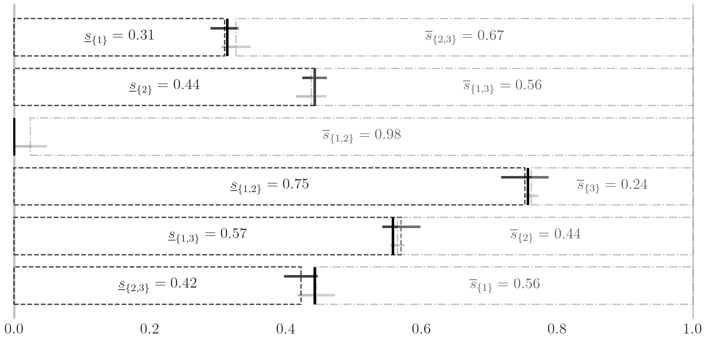
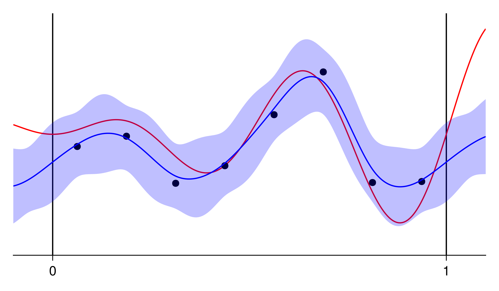

* Will be replaced with the ToC, excluding the "Contents" header
{:toc}

# Softwares

## QMCPy

[QMCPy](https://qmcpy.readthedocs.io/en/latest/md_rst/QMCSoftware.html) is a Python package for Quasi-Monte Carlo which includes quasi-random (low discrepancy) sequence generators, automatic variable transforms, adaptive stopping criteria, and a suite of diverse use cases. 

```
pip install qmcpy 
```




## QMCGenerators.jl

[QMCGenerators.jl](https://alegresor.github.io/QMCGenerators.jl/stable/) is a Julia package for quasi-random (low discrepancy) sequence generators. Lattice and digital sequences, including higher order versions, are supported along with a variety of randomization routines. This is a translation and enhancement of Dirk Nuyens' [Magic Point Shop](https://people.cs.kuleuven.be/~dirk.nuyens/qmc-generators/). 

```
] add QMCGenerators
```


## QuasiGaussianProcesses.jl

[QuasiGaussianProcesses.jl](https://alegresor.github.io/QuasiGaussianProcesses.jl/stable) is a Julia package for fast construction and evaluation of Gaussian processes regression models when one controls the design of experiments. By choosing a design of $n$ quasi-random (low discrepancy) points and matching the GP covariance kernel, the cost is reduced from $\mathcal{O}(n^3)$ to $\mathcal{O}(n \log n)$. 

```
] add QuasiGaussianProcesses
```




# Posters

## Probabilistic Models for PDEs with Random Coefficients

2023 Los Alamos National Laboratory Student Symposium

<embed src="./posters/2023_GP4DarcyPDE_LANL.pdf" type="application/pdf" width="1000" height="810"/>

## Credible Intervals for Probability of Failure with Gaussian Processes

2022 IIT Welcome Week Student Research Poster Day

<embed src="./posters/2023_PFGPCredibleIntervals_Own.pdf" type="application/pdf" width="1000" height="810"/>

## Robust Approximation of Sensitivity Indices in QMCPy

[2022 Conference on Sensitivity Analysis of Model Output (SAMO)](https://samo2022.math.fsu.edu/)

<embed src="./posters/2022_SensitivityIndicesQMCPy_SAMO.pdf" type="application/pdf" width="1000" height="810"/>

## QMCPy: Quasi-Monte Carlo Software in Python

2021 Chicago Area Undergraduate Research Symposium

<embed src="./posters/2021_QMCPy_CAURS.pdf" type="application/pdf" width="1000" height="810"/>


## Other Posters

- [QMCPy: A Quasi-Monte Carlo Software in Python 3.](./posters/2021_QMCPy_SIAMCSE.pdf) @ [2021 SIAM Conference on Computational Science and Engineering](https://www.siam.org/conferences/cm/conference/cse21)

- [Multi-threaded/-processed Requests to Cloud Services for Intelligent Address Standardization](./posters/2019_PRLAS_SIAMCSE.pdf) @ [2019 SIAM Conference on Computational Science and Engineering](https://www.siam.org/conferences/cm/conference/cse19)

# Presentations

## Probabilistic Models for PDEs with Random Coefficients

2023 Los Alamos National Laboratory Student Lightening Talks

<embed src="./presentations/2023_GP4DarcyPDE_LANL.pdf" type="application/pdf" width="1000" height="600"/>

## Adaptive Probability of Failure Estimation with Gaussian Processes

[2023 SIAM Conference on Computational Science and Engineering](https://www.siam.org/conferences/cm/conference/cse23)

<embed src="./presentations/2023_PFGPErrorBounds_SIAMCSE.pdf" type="application/pdf" width="1000" height="600"/>

## Monte Carlo with QMCPy for Vector Functions of Integrals

[2023 PyData Chicago](https://chicago.pydata.org/)

<embed src="./presentations/2023_QMCPy_PyDataChi.pdf" type="application/pdf" width="1000" height="600"/>

## Unified Framework for Quasi-Monte Carlo Software

[2023 Monte Carlo Methods and Applications](https://mcm2023.sciencesconf.org/)

<embed src="./presentations/2023_UnifiedQMCSoftware_MCM.pdf" type="application/pdf" width="1000" height="600"/>

## Other Presentations

- [QMCPy Client for UM-Bridge](./presentations/2022_QMCPyUMBrige_UMBrigeWorkshop.pdf) @ [2022 UM-Bridge Workshop](https://um-bridge.github.io/workshop/)
- [Quasi-Monte Carlo for Functions of Multi-Dimensional Integrals](./presentations/2022_QMCPyVectorization_MCQMC.pdf) @ [2022 Monte Carlo and Quasi-Monte Carlo Methods in Scientific Computing Conferene](https://www.ricam.oeaw.ac.at/events/conferences/mcqmc2022/)
- [QMCPy, A Quasi-Monte Carlo Framework](./presentations/2021_QMCPy_MidwestNumericalAnalysis.pdf) @ [2021 Midwest Numerical Analysis Day](https://web.mst.edu/~hex/MWNAD/MWNAD2021.html)
- [Building QMCPy's Quasi-Monte Carlo Framework.](./presentations/2021_QMCPy_MCM.pdf) @ [2021 International Conference on Monte Carlo Methods and Applications](https://www.uni-mannheim.de/mcm-2021/)
- [QMCPy Quasi-Monte Carlo Software](./presentations/2021_QMCPy_SIAMGL.pdf) @ [2021 SIAM Great Lakes Section Meeting](https://sites.google.com/oakland.edu/glsiam2021/)
- [(Quasi)-Monte Carlo Importance Sampling with QMCPy.](./presentations/2021_QMCPyIS_CompMathIIT.pdf) 2021 Computational Mathematics Seminar, Department of Applied Mathematics, Illinois Institute of Technology
- [QMCPy: A Quasi-Monte Carlo Software in Python 3](./presentations/2020_QMCPy_CASSC.pdf) @ [2020 Chicago Area SIAM Student Conference](https://siam-northwestern.github.io/cassc_2020.html)
- [QMCPy: A Quasi-Monte Carlo Software in Python 3.](./presentations/2020_QMCPy_PyDataChicago.pdf) @ [2020 PyData Chicago](https://chicago.pydata.org/)
